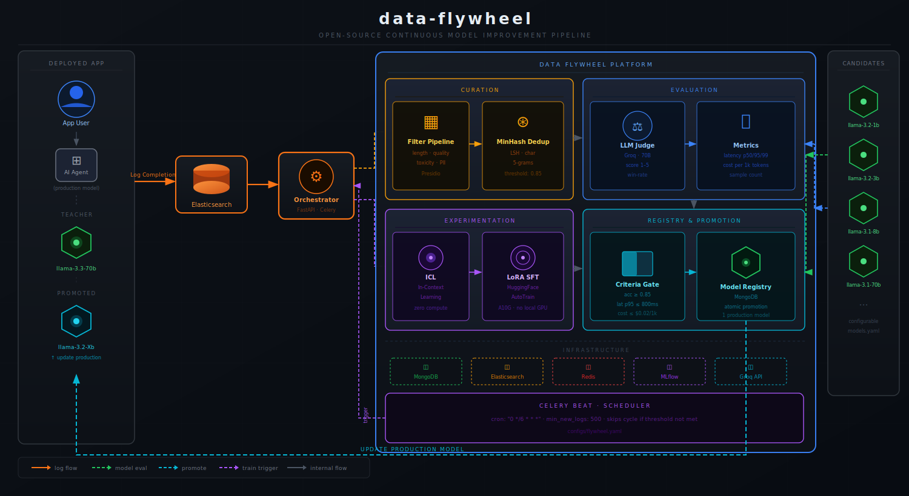

# data-flywheel

A self-improving AI pipeline that continuously refines language models using real production traffic. Curates inference logs, fine-tunes smaller candidate models, evaluates them against a teacher model, and promotes the best performer — automatically.

Where a standard fine-tuning workflow requires manually curated datasets and scheduled retraining jobs, this system closes the loop — production traffic becomes training data, smaller models are continuously evaluated against a teacher, and the best candidate replaces the current production model without human intervention.

Inspired by the [NVIDIA Data Flywheel Blueprint](https://build.nvidia.com/nvidia/build-an-enterprise-data-flywheel), built entirely on open-source tooling with no local GPU required.



---

## Overview

A data flywheel is a continuous improvement loop where each cycle makes the next one better:

1. **Ingest** — production inference logs accumulate in Elasticsearch
2. **Curate** — filter, deduplicate, and quality-score the logs into a clean dataset
3. **Experiment** — run ICL (zero compute) and LoRA SFT (HuggingFace AutoTrain) on candidate models
4. **Evaluate** — LLM judge scores candidates against the teacher; latency and cost are measured
5. **Promote** — candidates that pass all criteria replace the production model; others are logged and skipped

The result: models that get cheaper and faster over time without sacrificing accuracy.

---

## Tech Stack

| Layer | Tool |
|---|---|
| Teacher model / LLM judge | Groq — Llama 3.3 70B |
| Candidate models | Groq — Llama 3.2 1B, 3B · Llama 3.1 8B |
| Fine-tuning | HuggingFace AutoTrain (LoRA SFT) |
| Orchestrator | FastAPI + Celery |
| Log store | Elasticsearch |
| State + model registry | MongoDB |
| Experiment tracking | MLflow |
| Task queue | Redis |
| Local dev | Docker Compose |

---

## Repo Structure

```
data-flywheel/
├── orchestrator/
│   ├── main.py                      FastAPI app entrypoint
│   ├── api/
│   │   ├── routes/                  flywheel · experiments · models · health
│   │   └── models/                  Pydantic request/response schemas
│   ├── core/
│   │   ├── config.py                Settings (pydantic-settings)
│   │   ├── database.py              MongoDB + Elasticsearch clients
│   │   ├── celery_app.py            Celery + Redis configuration
│   │   └── flywheel_loop.py         Celery chain orchestrator
│   ├── services/
│   │   ├── curator/                 pipeline · filters · dedup
│   │   ├── customizer/              lora_sft · hf_client
│   │   ├── evaluator/               judge · metrics · benchmarks
│   │   └── deployment/              manager · registry · groq_client
│   ├── workers/                     curate · finetune · evaluate · promote
│   └── utils/                       logging · mlflow
├── configs/
│   ├── flywheel.yaml                schedule · curation thresholds
│   ├── models.yaml                  teacher + candidate model definitions
│   └── eval_criteria.yaml           promotion criteria
├── infra/
│   ├── docker/                      Dockerfile · docker-compose (dev)
│   └── scripts/                     setup · seed · reset
├── notebooks/
│   ├── exploration.ipynb            inspect raw logs, filter drop rates, quality scores
│   ├── evaluation_analysis.ipynb    judge scores, latency/cost tradeoffs per model
│   └── flywheel_results.ipynb       improvement across cycles, promotion history
├── tests/
│   ├── unit/                        curator · evaluator (no services needed)
│   └── integration/                 full API lifecycle
├── .env.sample
├── requirements.txt
└── Makefile
```

---

## API Keys Required

| Service | Purpose | Free Tier |
|---|---|---|
| Groq | Teacher model (Llama 3.3 70B) + LLM judge + candidate inference | Yes |
| HuggingFace | LoRA SFT via AutoTrain — dataset upload + job submission | Yes |

Get them here:
- **Groq** → https://console.groq.com
- **HuggingFace** → https://huggingface.co/settings/tokens

---

## Getting Started

**Prerequisites**
- Docker + Docker Compose
- Python 3.12+

**Installation — pip**

```bash
git clone https://github.com/tohio/data-flywheel
cd data-flywheel

python -m venv .venv
source .venv/bin/activate        # Mac / Linux
# .venv\Scripts\activate         # Windows

pip install -r requirements.txt
cp .env.sample .env
# Add your API keys to .env
```

**Installation — uv**

```bash
git clone https://github.com/tohio/data-flywheel
cd data-flywheel

uv venv
source .venv/bin/activate        # Mac / Linux
# .venv\Scripts\activate         # Windows

uv pip install -r requirements.txt
cp .env.sample .env
# Add your API keys to .env
```

**Add your API keys**

```bash
# Edit .env:
GROQ_API_KEY=...
HF_TOKEN=...
```

**Start services**

```bash
make up
```

**Run the flywheel**

```bash
make seed          # seed Elasticsearch with synthetic inference logs
make run-flywheel  # POST /flywheel/run — triggers a full cycle
```

**Monitor**

```bash
open http://localhost:8000/docs   # API explorer
open http://localhost:5000        # MLflow experiments
make logs                         # tail orchestrator + worker logs
```

**Test**

```bash
make test      # unit tests (no services needed)
make test-all  # unit + integration (requires make up)
```

**Reset**

```bash
bash infra/scripts/reset.sh   # wipe all local state and volumes
```

---

## Key Design Decisions

**Celery chain for the loop** — each stage (curate → finetune → evaluate → promote) is a Celery task wired into a chain. Results flow forward automatically. Each stage updates a MongoDB run document so the loop is fully observable via `GET /flywheel/status/{run_id}` at any point.

**No labeled data required** — the teacher model (Llama 3.3 70B) labels production logs on the fly. The LLM judge scores candidates against teacher responses. The flywheel runs from day one with zero human annotation.

**Two experiment types** — ICL (in-context learning) evaluates the base candidate model with few-shot examples — no training, instant results. LoRA SFT runs parameter-efficient fine-tuning via HuggingFace AutoTrain on A10G GPUs without requiring local GPU hardware.

**Atomic promotion** — the model registry enforces exactly one production model at all times. Promoting a candidate archives the previous model in a single MongoDB operation before setting the new one, so there is never a window with zero production models.

**Criteria gating** — promotion requires passing all four thresholds from `eval_criteria.yaml` (accuracy, latency p95, cost per 1k tokens, minimum eval sample size). Any failure is recorded with a specific reason so it is clear why a candidate was rejected.

**Heuristic-only curation** — the filter pipeline uses no models. Quality scoring is based on alpha ratio, punctuation density, and bigram repetition. PII redaction uses Presidio. Near-deduplication uses MinHash LSH over character 5-grams. Fast, cheap, no GPU.

---

## Evaluation

Each flywheel cycle produces a full evaluation report logged to MLflow:

- **Accuracy** — LLM judge win-rate: fraction of candidate responses scoring ≥ 4/5 against the teacher
- **Latency** — p50, p95, and p99 response times measured over the eval sample
- **Cost** — total and per-1k-token cost at Groq pricing for each candidate model
- **Sample size** — number of eval samples used (minimum 100 required for promotion)

Results are compared against thresholds in `configs/eval_criteria.yaml`. Candidates that pass all four are promoted; those that fail are archived with a per-criterion failure reason. The `notebooks/evaluation_analysis.ipynb` notebook visualises score distributions and accuracy vs latency vs cost tradeoffs across runs.

---

## Customization

### `configs/models.yaml` — define teacher and candidates

```yaml
teacher:
  provider: groq
  model: llama-3.3-70b-versatile

candidates:
  - id: llama-3b
    provider: groq
    model: llama-3.2-3b-preview
    experiments: [icl, lora_sft]
```

### `configs/eval_criteria.yaml` — set promotion thresholds

```yaml
promotion_criteria:
  min_accuracy: 0.85
  max_latency_p95_ms: 800
  max_cost_per_1k_tokens: 0.02
  min_eval_sample_size: 100
```

### `configs/flywheel.yaml` — control the loop

```yaml
schedule:
  cron: "0 */6 * * *"
  min_new_logs: 500
```

---

## Production Considerations

This project is scoped to run as a standalone service. In a production deployment:

- **Security** — Elasticsearch runs with `xpack.security.enabled=false` for local dev. In production, TLS and authentication should be enabled.
- **Scheduling** — the flywheel is triggered manually via `POST /flywheel/run`. In production, Celery Beat reads the cron from `flywheel.yaml` and fires the loop automatically.
- **Persistence** — MongoDB and Elasticsearch use Docker named volumes locally. In production these should be backed by durable block storage.
- **Secrets** — API keys are loaded from `.env`. In production these should come from a secrets manager rather than a file on disk.
- **Observability** — structured JSON logs are written to stdout. In production these should be shipped to a log aggregator.

---

## Related Projects

- [slm](https://github.com/tohio/slm) — GPT-style LLM trained from scratch with NeMo
- [agentic-rag](https://github.com/tohio/agentic-rag) — agentic RAG with tool use and reasoning
- [rag-pipeline](https://github.com/tohio/rag-pipeline) — baseline modular RAG pipeline
- [multi-agent](https://github.com/tohio/multi-agent) — autonomous multi-agent investment research
