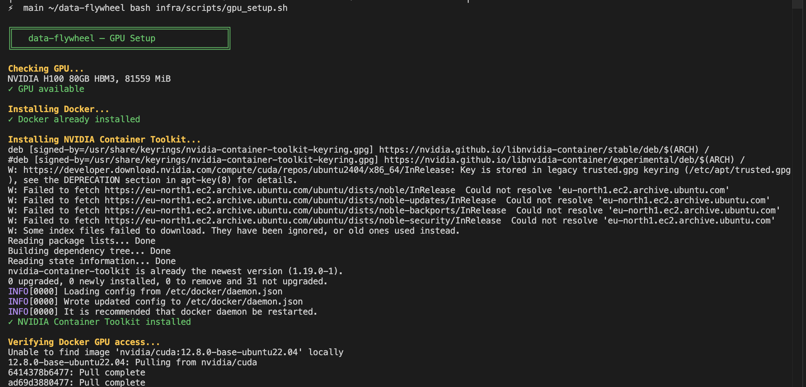
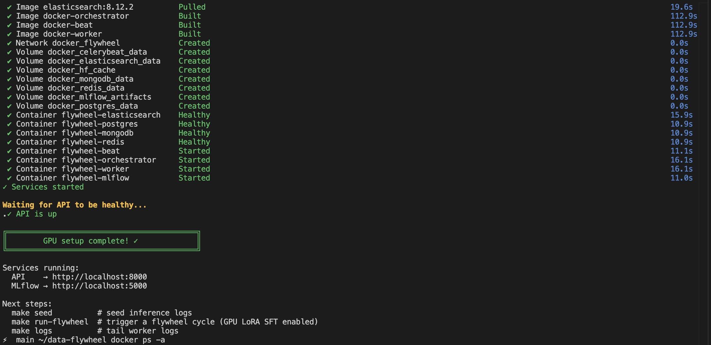
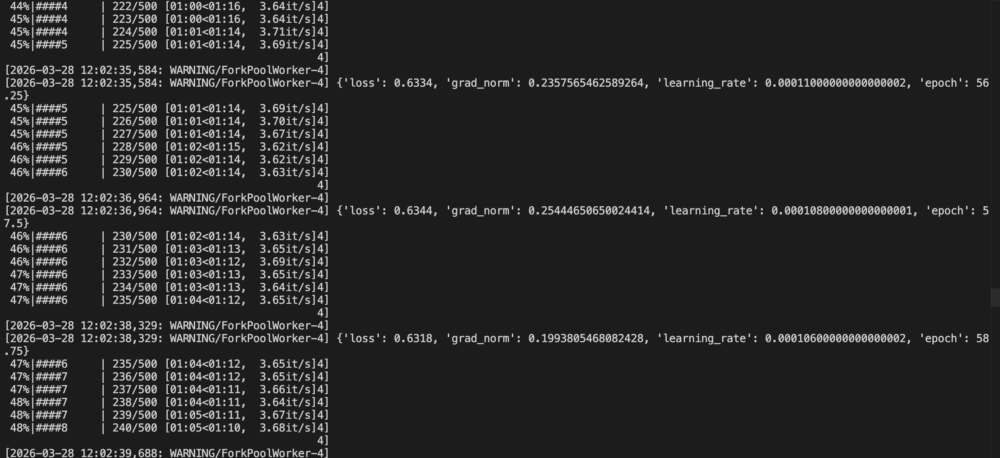
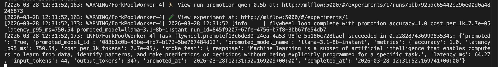
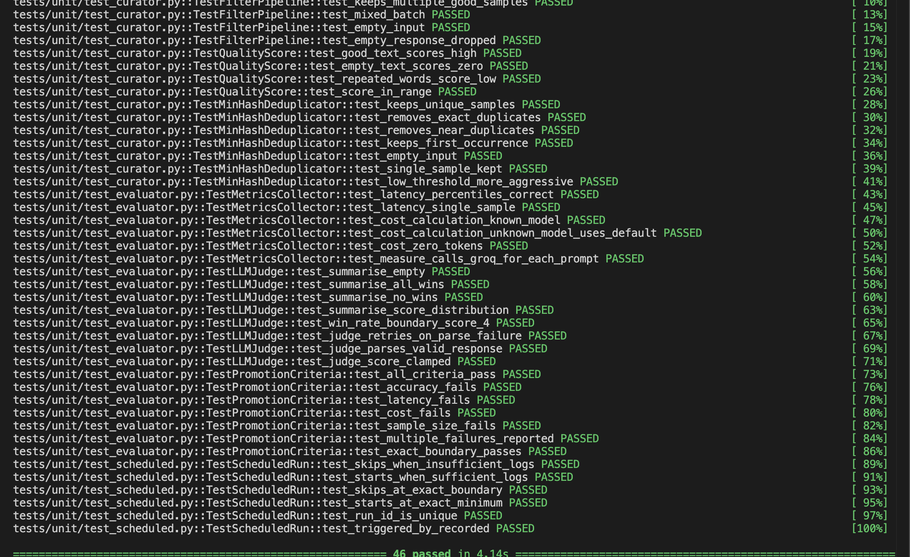

# data-flywheel

A self-improving AI pipeline that continuously refines language models using real production traffic. Curates inference logs, fine-tunes smaller candidate models, evaluates them against a teacher model, and promotes the best performer — automatically.

Where a standard fine-tuning workflow requires manually curated datasets and scheduled retraining jobs, this system closes the loop — production traffic becomes training data, smaller models are continuously evaluated against a teacher, and the best candidate replaces the current production model without human intervention.

Inspired by the [NVIDIA Data Flywheel Blueprint](https://build.nvidia.com/nvidia/build-an-enterprise-data-flywheel), built entirely on open-source tooling.


---

## Overview

A data flywheel is a continuous improvement loop where each cycle makes the next one better:

1. **Ingest** — production inference logs accumulate in Elasticsearch
2. **Curate** — filter, deduplicate, and quality-score the logs into a clean dataset
3. **Experiment** — run ICL (zero compute) and LoRA SFT (TRL + PEFT) on candidate models
4. **Evaluate** — LLM judge scores candidates against the teacher; latency and cost are measured
5. **Promote** — candidates that pass all criteria replace the production model; others are logged and skipped

The result: models that get cheaper and faster over time without sacrificing accuracy.

---

## Tech Stack

| Layer | Tool |
|---|---|
| Teacher model / LLM judge | Groq — Llama 3.3 70B |
| Candidate models | Groq — Llama 3.2 1B, 3B · Llama 3.1 8B |
| Fine-tuning | TRL + PEFT (LoRA SFT) |
| Orchestrator | FastAPI + Celery |
| Log store | Elasticsearch |
| State + model registry | MongoDB |
| Experiment tracking | MLflow + PostgreSQL |
| Task queue | Redis |
| Local dev | Docker Compose |

---

## Hardware Requirements

| Mode | Requirement | Notes |
|---|---|---|
| Local dev (no GPU) | Docker + 8GB RAM | ICL only — LoRA SFT runs 10 steps as a smoke test |
| Full LoRA SFT | NVIDIA GPU (4GB+ VRAM) | Runs all 500 training steps with 4-bit quantization |
| Recommended | NVIDIA T4 or better | Sufficient for Qwen 2.5 0.5B–3B |
| Tested on | NVIDIA H100 80GB HBM3 | Lightning.ai (Nebius) — full cycle ~40-50 minutes |

LoRA SFT training detects the available hardware automatically — on CPU it runs 10 steps to validate the pipeline, on GPU it runs the full training job with 4-bit quantization.

### End-to-end timing (H100 80GB)

| Stage | Time |
|---|---|
| Curation | ~30s |
| LoRA SFT — Qwen 2.5 0.5B (500 steps) | ~2 min |
| LoRA SFT — Qwen 2.5 1.5B (500 steps) | ~5 min |
| LoRA SFT — Qwen 2.5 3B (500 steps) | ~10 min |
| Evaluation (6 experiments × 64 samples) | ~20-30 min |
| Promotion | ~1s |
| **Total** | **~40-50 min** |

Evaluation time is dominated by Groq API rate limits, not compute.

---

## Repo Structure

```
data-flywheel/
├── configs/
│   ├── eval_criteria.yaml        — promotion thresholds (accuracy, latency, cost)
│   ├── flywheel.yaml             — cron schedule, curation settings, training config
│   └── models.yaml               — teacher model + candidate definitions
├── docs/
│   ├── api_reference.md
│   ├── architecture.md
│   ├── architecture.svg
│   ├── flywheel_loop.md
│   └── screenshots/              — gpu_setup, services_up, lora_training, promotion, tests
├── infra/
│   ├── docker/
│   │   ├── docker-compose.yml    — all services + GPU deploy block + hf_cache volume
│   │   ├── Dockerfile.orchestrator
│   │   └── Dockerfile.worker
│   └── scripts/
│       ├── gpu_setup.sh          — one-command GPU instance setup
│       ├── reset.sh              — wipe all data and volumes
│       ├── seed_logs.py          — seed 1000 synthetic inference logs
│       └── setup.sh
├── notebooks/
│   ├── architecture_walkthrough.ipynb  — guided tour of all 8 components
│   ├── evaluation_analysis.ipynb       — judge scores, latency/cost tradeoffs
│   ├── exploration.ipynb               — raw logs, filter drop rates, quality scores
│   └── flywheel_results.ipynb          — improvement across cycles, promotion history
├── orchestrator/
│   ├── api/
│   │   ├── models/               — Pydantic request/response schemas
│   │   └── routes/               — flywheel, experiments, models, health endpoints
│   ├── core/
│   │   ├── celery_app.py         — Celery application + broker config
│   │   ├── config.py             — settings from environment variables
│   │   ├── database.py           — MongoDB async client
│   │   └── flywheel_loop.py      — start_flywheel_run + resume_flywheel_run tasks
│   ├── services/
│   │   ├── curator/
│   │   │   ├── dedup.py          — MinHash LSH near-deduplication
│   │   │   ├── filters.py        — quality scoring, PII redaction, length filtering
│   │   │   └── pipeline.py       — full curation orchestration
│   │   ├── customizer/
│   │   │   ├── hf_client.py      — HuggingFace Hub dataset upload + adapter push
│   │   │   └── lora_sft.py       — ICL registration + LoRA SFT via TRL + PEFT
│   │   ├── deployment/
│   │   │   ├── groq_client.py    — Groq inference client
│   │   │   ├── manager.py        — deployment manager
│   │   │   └── registry.py       — model registry read/write
│   │   └── evaluator/
│   │       ├── benchmarks.py     — EvaluationSuite orchestrating metrics + judge
│   │       ├── judge.py          — LLM-as-judge scoring via Groq
│   │       └── metrics.py        — latency + cost measurement, MetricsSummary
│   ├── utils/
│   │   ├── elasticsearch.py
│   │   ├── logging.py            — structured logging via structlog
│   │   └── mlflow_client.py      — MLflow experiment tracking helpers
│   ├── workers/
│   │   ├── curate.py             — Stage 1: curation Celery task
│   │   ├── evaluate.py           — Stage 3: evaluation Celery task
│   │   ├── finetune.py           — Stage 2: finetuning Celery task
│   │   ├── promote.py            — Stage 4: promotion Celery task
│   │   └── scheduled.py          — Celery Beat scheduled entry point
│   └── main.py                   — FastAPI app + router registration
├── tests/
│   ├── integration/
│   │   └── test_flywheel_loop.py
│   └── unit/
│       ├── test_curator.py       — FilterPipeline + MinHashDeduplicator tests
│       ├── test_evaluator.py     — MetricsCollector + LLMJudge + promotion criteria
│       └── test_scheduled.py     — Celery Beat scheduled run tests
├── Makefile                      — up, down, seed, run-flywheel, resume-flywheel, test, lint
├── pyproject.toml
├── requirements.txt              — torch==2.4.0 pinned for CUDA 12.4 compatibility
└── requirements-dev.txt
```


## API Keys Required

| Service | Purpose | Free Tier |
|---|---|---|
| Groq | Teacher model (Llama 3.3 70B) + LLM judge + candidate inference | Yes |
| HuggingFace | LoRA SFT — dataset upload + adapter push | Yes |

Get them here:
- **Groq** → https://console.groq.com  *(note: Hotmail/Outlook accounts are not accepted — use Gmail or another provider)*
- **HuggingFace** → https://huggingface.co/settings/tokens — create a token with **Write** permissions

---

## Getting Started

### Local (no GPU — ICL only)

**Prerequisites**
- Docker + Docker Compose
- Python 3.12+

**Installation — pip**

```bash
git clone https://github.com/tohio/data-flywheel
cd data-flywheel

python -m venv .venv
source .venv/bin/activate        # Mac / Linux
# .venv\Scripts\activate         # Windows

pip install -r requirements.txt -r requirements-dev.txt
cp .env.sample .env
# Add your API keys to .env
```

**Installation — uv**

```bash
git clone https://github.com/tohio/data-flywheel
cd data-flywheel

uv venv
source .venv/bin/activate        # Mac / Linux
# .venv\Scripts\activate         # Windows

uv pip install -r requirements.txt -r requirements-dev.txt
cp .env.sample .env
# Add your API keys to .env
```

**Add your API keys**

```bash
# Edit .env:
GROQ_API_KEY=...
HF_TOKEN=...
HF_USERNAME=...
```

**Start services**

```bash
make up
```

**Run the flywheel**

```bash
make seed          # seed Elasticsearch with synthetic inference logs
make run-flywheel  # POST /flywheel/run — triggers a full cycle
```

---

### Cloud GPU (Lightning.ai, Lambda Labs, Vast.ai, RunPod)

Any Ubuntu cloud GPU instance works. The setup script installs Docker and the NVIDIA Container Toolkit automatically.

| Provider | Notes |
|---|---|
| Lightning.ai (Nebius) | Tested — H100 80GB available, persistent storage |
| Lambda Labs | Persistent storage, A10, A100, H100 available |
| Vast.ai | Cheapest hourly GPU rates |
| RunPod | Good A40/A100/H100 availability |

```bash
git clone https://github.com/tohio/data-flywheel
cd data-flywheel
bash infra/scripts/gpu_setup.sh
```

`gpu_setup.sh` verifies the GPU, installs Docker and the NVIDIA Container Toolkit, starts all services, and waits for the API to be healthy.

```bash
make seed          # seed Elasticsearch with synthetic inference logs
make run-flywheel  # triggers a full cycle including GPU LoRA SFT
```

---

### Any NVIDIA GPU

The compose file requests `count: 1, driver: nvidia` — it uses whatever GPU is available on the host. Works on T4, A10G, A100, H100, V100, or any NVIDIA GPU without config changes.

---

## Monitor

```bash
open http://localhost:8000/docs   # API explorer
open http://localhost:5000        # MLflow experiments
make logs                         # tail orchestrator + worker logs
```

## Test

```bash
make test      # unit tests (no services needed)
make test-all  # unit + integration (requires make up)
```

## Reset

```bash
bash infra/scripts/reset.sh   # wipe all local state and volumes
```

---

## Screenshots

### GPU Setup — NVIDIA H100 80GB detected and verified



### Services — all 8 containers healthy and running



### LoRA SFT Training — Qwen 2.5 0.5B on H100 at 3.6 it/s



### Promotion — model promoted with accuracy=1.0, latency p95=750ms



### Unit Tests — 46/46 passing



---

## Key Design Decisions

**Celery chain for the loop** — each stage (curate → finetune → evaluate → promote) is a Celery task wired into a chain. Results flow forward automatically. Each stage updates a MongoDB run document so the loop is fully observable via `GET /flywheel/status/{run_id}` at any point.

**No labeled data required** — the teacher model (Llama 3.3 70B) labels production logs on the fly. The LLM judge scores candidates against teacher responses. The flywheel runs from day one with zero human annotation.

**Two experiment types** — ICL (in-context learning) evaluates the base candidate model with few-shot examples — no training, instant results. LoRA SFT runs parameter-efficient fine-tuning with TRL + PEFT directly in the worker. On CPU it runs 10 steps to validate the pipeline; on GPU it runs the full training job with 4-bit quantization.

**Atomic promotion** — the model registry enforces exactly one production model at all times. Promoting a candidate archives the previous model in a single MongoDB operation before setting the new one, so there is never a window with zero production models.

**Criteria gating** — promotion requires passing all four thresholds from `eval_criteria.yaml` (accuracy, latency p95, cost per 1k tokens, minimum eval sample size). Any failure is recorded with a specific reason so it is clear why a candidate was rejected.

**Heuristic-only curation** — the filter pipeline uses no models. Quality scoring is based on alpha ratio, punctuation density, and bigram repetition. PII redaction uses Presidio. Near-deduplication uses MinHash LSH over character 5-grams. Fast, cheap, no GPU.

---

## Evaluation

Each flywheel cycle produces a full evaluation report logged to MLflow:

- **Accuracy** — LLM judge win-rate: fraction of candidate responses scoring ≥ 4/5 against the teacher
- **Latency** — p50, p95, and p99 response times measured over the eval sample
- **Cost** — total and per-1k-token cost at Groq pricing for each candidate model
- **Sample size** — number of eval samples used (minimum 100 required for promotion)

Results are compared against thresholds in `configs/eval_criteria.yaml`. Candidates that pass all four are promoted; those that fail are archived with a per-criterion failure reason. The `notebooks/evaluation_analysis.ipynb` notebook visualises score distributions and accuracy vs latency vs cost tradeoffs across runs.

---

## Customization

### `configs/models.yaml` — define teacher and candidates

```yaml
teacher:
  provider: groq
  model: llama-3.3-70b-versatile

candidates:
  - id: qwen-0.5b
    provider: groq
    model: llama-3.2-1b-preview        # Groq model name (used for inference)
    hf_model: Qwen/Qwen2.5-0.5B        # HF Hub model ID (used for TRL training)
    experiments: [icl, lora_sft]
    target: low_cost
```

### `configs/eval_criteria.yaml` — set promotion thresholds

```yaml
promotion_criteria:
  min_accuracy: 0.85
  max_latency_p95_ms: 800
  max_cost_per_1k_tokens: 0.02
  min_eval_sample_size: 100
```

### `configs/flywheel.yaml` — control the loop

```yaml
schedule:
  cron: "0 */6 * * *"
  min_new_logs: 500
```

---

## Production Considerations

This project is scoped to run as a standalone service. In a production deployment:

- **GPU** — the worker container requests one NVIDIA GPU via the compose file. Any NVIDIA GPU works — T4, A10G, A100, V100. The training code adapts automatically.
- **Security** — Elasticsearch runs with `xpack.security.enabled=false` for local dev. In production, TLS and authentication should be enabled.
- **Scheduling** — the flywheel is triggered manually via `POST /flywheel/run`. In production, Celery Beat reads the cron from `flywheel.yaml` and fires the loop automatically.
- **Persistence** — MongoDB and Elasticsearch use Docker named volumes locally. In production these should be backed by durable block storage.
- **Secrets** — API keys are loaded from `.env`. In production these should come from a secrets manager rather than a file on disk.
- **Observability** — structured JSON logs are written to stdout. In production these should be shipped to a log aggregator.

---

## Related Projects

- [slm](https://github.com/tohio/slm) — GPT-style LLM trained from scratch with NeMo
- [agentic-rag](https://github.com/tohio/agentic-rag) — agentic RAG with tool use and reasoning
- [rag-pipeline](https://github.com/tohio/rag-pipeline) — baseline modular RAG pipeline
- [multi-agent](https://github.com/tohio/multi-agent) — autonomous multi-agent investment research